**Learn to build Flappy Fly!**

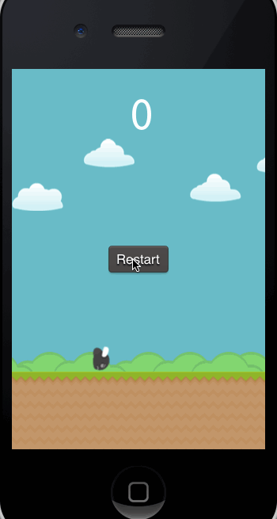

* * *

This is the one and only tutorial that will teach you how to implement a native Flappy Bird clone for iOS.  We will be using SpriteBuilder and Cocos2d 3.0 and walk you through all the steps starting with a blank project.

If you aren't familiar with SpriteBuilder you should consider starting with our [beginner tutorial](https://www.makegameswith.us/tutorials/getting-started-with-spritebuilder/) as we won't repeat all basic concepts of SpriteBuilder.

If you complete this tutorial you will learn how to:

*   implement an endless scroller
*   implement procedural level generation
*   use Coco2d 3.4 physics

The solution to this tutorial is available on [GitHub](https://github.com/MakeSchool-Tutorials/Flappy-Bird-SpriteBuilder):

Let's get started with *Flappy Fly.*

# Getting Started

First of all let's check we are on the same page. This tutorial is written using SpriteBuilder 1.4.9. It is important that you use at least this version - as of this writing we are still using a pre-release version of Cocos2d 3.4 and using an older version of SpriteBuilder may lead to different results in some of the steps.

Check your version of SpriteBuilder:

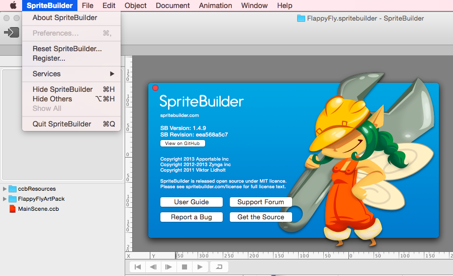

As always the first step is to create a new SpriteBuilder project. Also [download our art pack for this game](https://s3.amazonaws.com/mgwu-misc/FlappyFlyArtPack.zip). Add the art pack you just downloaded to your SpriteBuilder project by dragging the folder into the Resource Pane on the left:

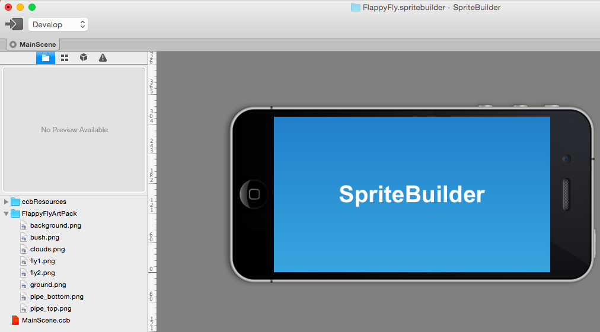

# Basic concepts of a side scroller in Cocos2d

If you have never built a side scroller before this introduction will help you understand some concepts. Most developers start developing a side scroller with a static hero and a level that scrolls towards this hero. However, for physics engines it is a lot easier if the hero moves through the level. We will implement the game as following:

*   The obstacles in the level are static
*   The fly moves to the right at constant speed
*   We implement a camera that follows the fly

This will make the fly appear at the same position during the complete game. If you can't follow don't worry, things will get easier once we put them into action.

# Setup the Gameplay scene

Before we can start we need to change to project settings. *Flappy Fly* is a portrait mode game and the assets for the game are provided in 2x (iPhone retina resolution). Open the project settings and adjust these two settings:

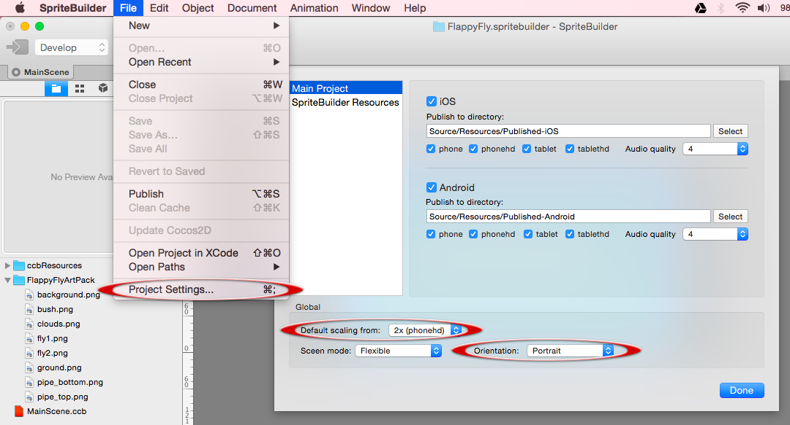

Now publish your project and run it in Xcode! Your simulator should be displayed in portrait mode.

## Adding Art

Time to add some art in SpriteBuilder. First, remove the label and the background image from the *MainScene*, leaving you with a blank screen.

## Background Image

Now add the background image:

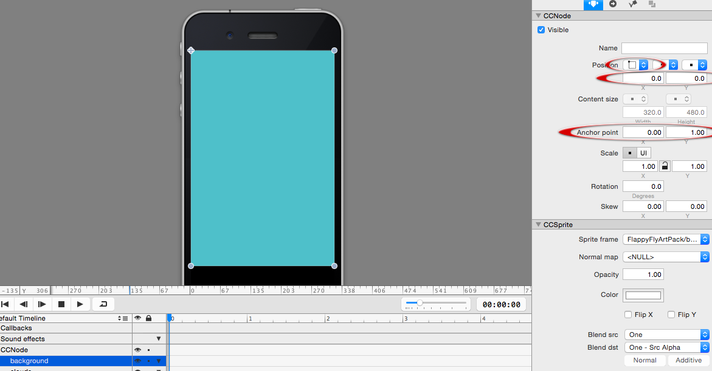

Set the reference corner to the top left (that means the position of the background will be defined starting in the top left corner). Set position to (0,0) and anchor point to (0,1). Now the background will stick at the top left corner, independent of the device size. This is important because we want to support 3.5-inch and 4 inch iPhones.

You can preview how your app will look on both of these devices using this setting:

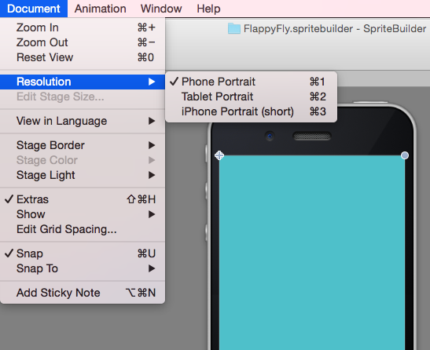

## Ground

The ground image has a bigger height than necessary - this way can adjust the space at the bottom of the screen to be bigger than we will make it in this tutorial. Add the ground image:

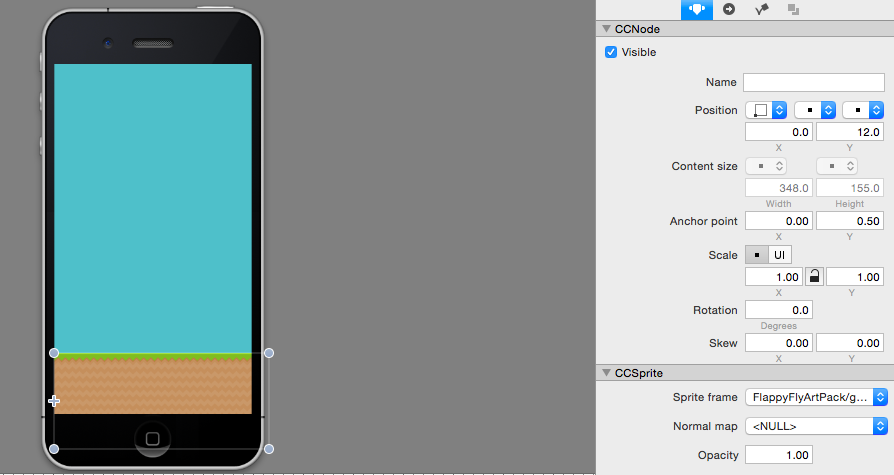

Set the reference corner to the left bottom. Set the position to (0, 12) and the anchor point to (0,0). This way the ground will stick at the left bottom, independent of the screen size.

## Clouds

Add the clouds to the scene:

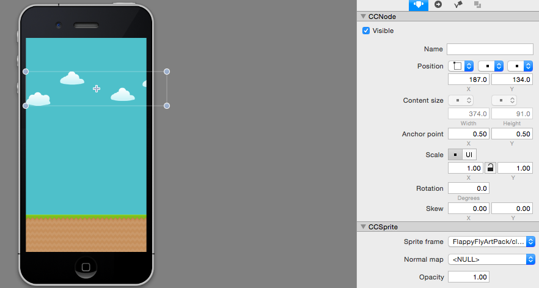

We want the clouds to be positioned from the top left corner, so set the reference corner to the top left. As position use (187,134) (or any other value you think looks good to provide you some sort of creative freedom ;) ).

# Creating the fly

Now we're going to create new *CCB-File* for the fly and add an animation for the hero in our game.

Create a new Sprite *CCB-File*:

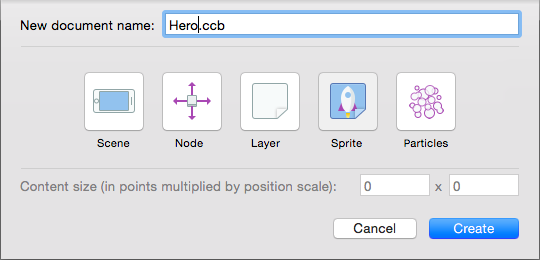

Set the sprite frame for the fly to *fly1.png* from the art pack:

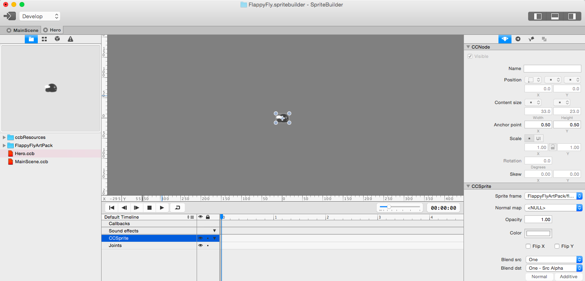

## Setting up the flying animation

If you have problems following the steps, you should take a look at the [chapter in our beginner tutorial](https://www.makegameswith.us/tutorials/getting-started-with-spritebuilder/animating-spritebuilder/) that explains timeline animations in detail. The animation we are about to define will be 1 second long and then loop. So in the first step we need to set the timeline duration to 1 second:

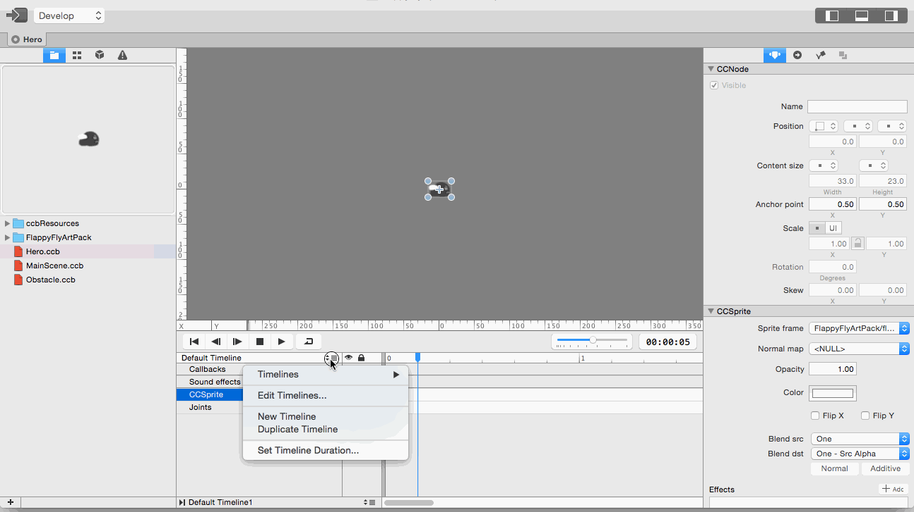

Now we are going to insert six *Sprite Frame Keyframes* in which we are going to switch between the two images *fly1.png* and *fly2.png.* This is how you insert a Sprite Frame Keyframe:

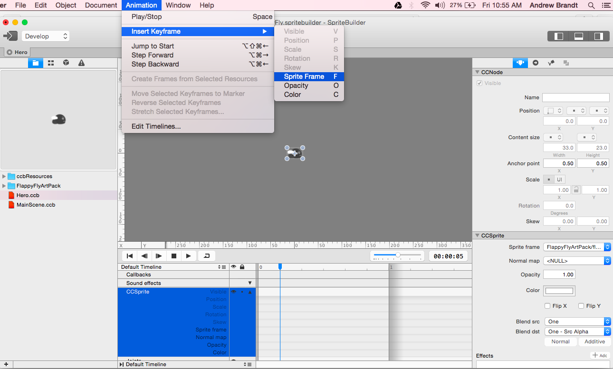

Note that the *CCSprite* needs to be selected in the timeline in order to add a Keyframe. Add 6 of these Sprite Frames and use the *Sprite Frame* property of the *CCSprite* to switch between the two different fly images. Also chain this timeline to itself, so that the animation is repeated infinitely. Once you are done, the result should look similar to this one:

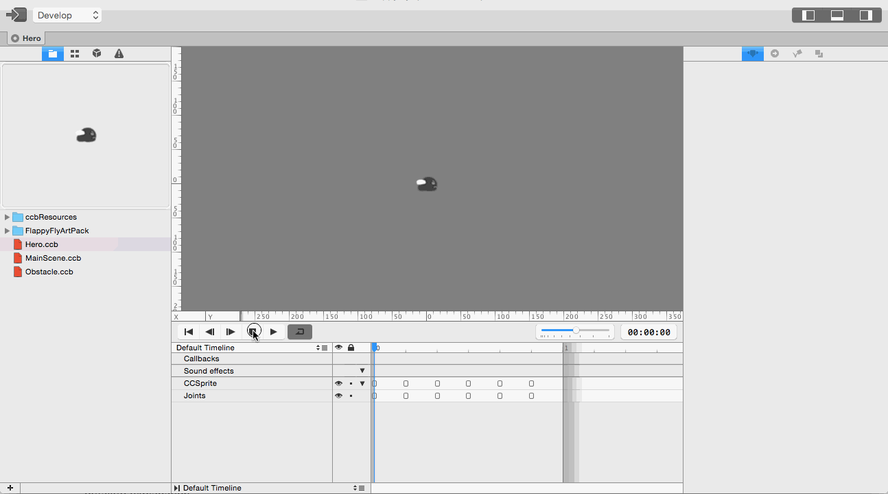

Once again, if you had problems with one of these steps please check the beginner tutorial for detailed explanation.

# Let the fly fall

Because our game uses physics we need to use a *CCPhysicsNode*. Open *MainScene.ccb* and drag a *CCPhysicsNode* below the root node, set the size of the CCPhysicsNode to be a 100% of the parents size:

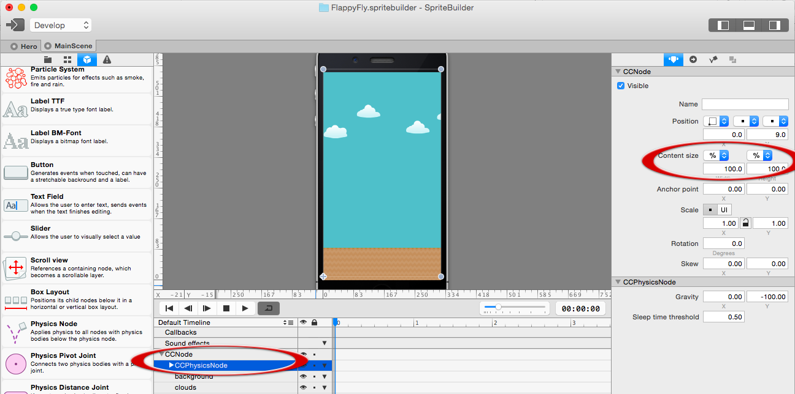

Now make the ground a static physics body and add it to the *CCPhysicsNode* (remember? Every Node that has physics enabled needs to be below a *CCPhysicsNode*!):

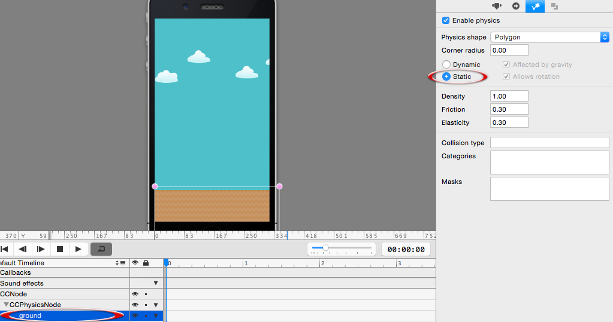

Now drag the *Hero.ccb* file to this scene to add the hero to the gameplay. Make the hero a child of the CCPhysicsNode and make the hero a dynamic physics object:

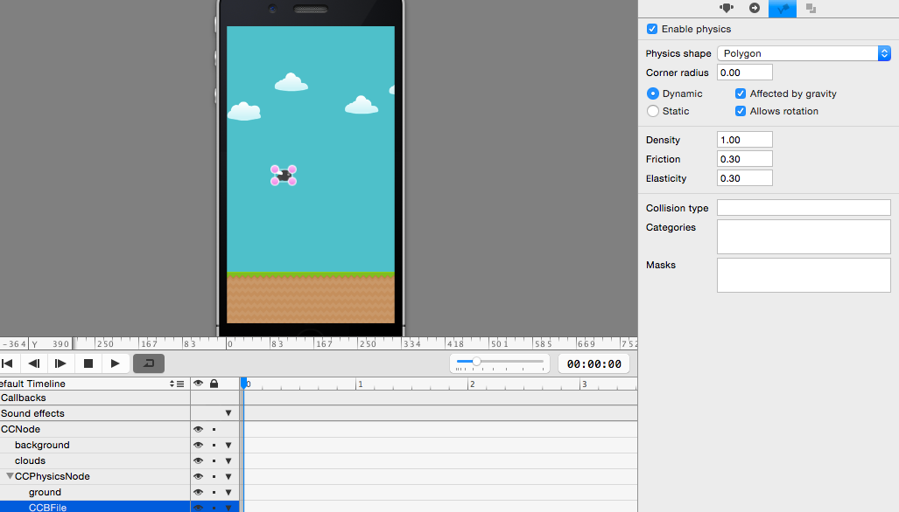

Now, before we run the game and see the fly drop lets add the bush above the ground to complete the visual appeal of *Flappy Fly*:

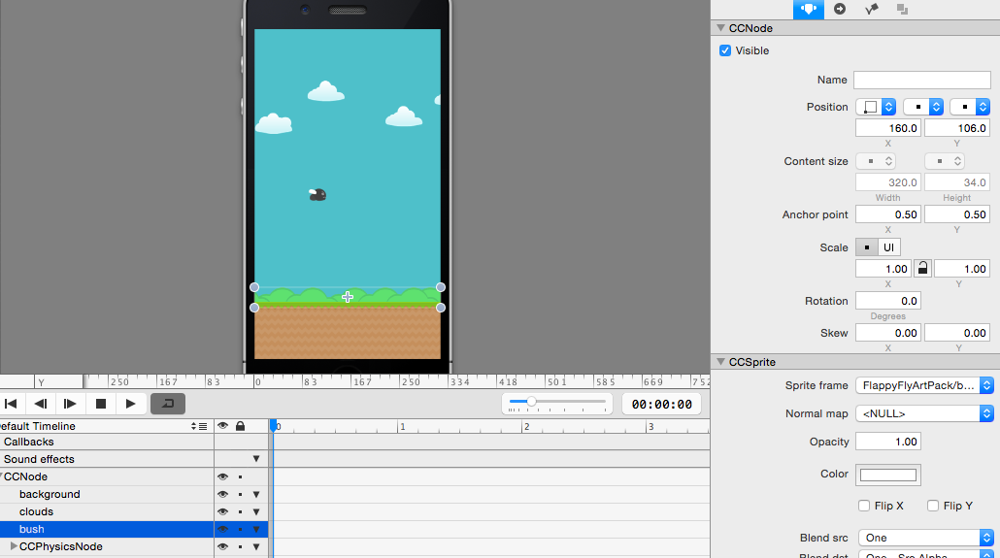

Set the reference corner for the bush to bottom left, just as you did for the ground. Also make sure that all the decorative elements are placed above the *CCPhysicsNode* in the timeline. This will ensure that the hero will be drawn in front of the background images.

You are now again ready to publish your project and run the App from Xcode. You should see the fly slowly sailing down and coming to a rest on the ground:

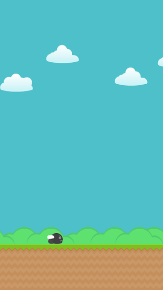

Great! Now let's get to the scrolling part of our game!

# Scroll the scene - move the fly

We are going to begin by moving the fly with a constant speed. First setup a code connection for the fly so that we can manipulate the velocity in code:

Now open Xcode, we are going to write some Objective-C code!

Replace the entire content of *MainScene.m* (except for the copyright header at the top) with this content:

    #import "MainScene.h"
    static const CGFloat scrollSpeed = 80.f;
    @implementation MainScene {
        CCSprite *_hero;
    }
    - (void)update:(CCTime)delta {
        _hero.position = ccp(_hero.position.x + delta * scrollSpeed, _hero.position.y);
    }
    @end

We are creating a private instance variable for our code connection *_hero*. We also define a constant for the scroll speed because we will reference it from various points in code later. Finally we implement the update method (which is called every frame by Cocos2d) and use it to modify the x position of the fly. By multiplying the scroll speed with *delta* we ensure that the fly always moves at the same speed , independent of the frame rate. *Disclaimer: setting the position manually in an update method is not the best use of a physics engine but this tutorial focuses on cloning flappy birds and not on physics best practices (stay tuned for such a tutorial in future).*

Once you added this code you can run your App. You should see the fly falling down and slowly grinding over the floor until it leaves the right edge of the screen.

You're right; as a next step we need to set up a camera to follow the fly.

## Setting up a "camera"

Cocos2d does not have the concept of a camera (though *CCActionFollow* comes close to it). This means we will implement the camera mechanism on our own. We do this by moving the complete content of the game to the left (to the player this looks the same as if the camera is moving to the right - in the end all movement is relative).

Just as in Flappy Bird the background images will be all static. The only things scrolling will be the obstacles and the ground. This means to implement the camera, we need to move the *physicsNode* to the left (obstacles, ground and hero are children of the physics node).

To scroll the physics node in code we need to setup a new code connection:

Now switch to Xcode and create a new private instance variable called *_physicsNode* for this code connection. Your private variables now should look like this:

    @implementation MainScene {
        CCSprite *_hero;
        CCPhysicsNode *_physicsNode;
    }

Now we are going to add a second step to our update method that will move the physics node:

    - (void)update:(CCTime)delta {
        _hero.position = ccp(_hero.position.x + delta * scrollSpeed, _hero.position.y);
        _physicsNode.position = ccp(_physicsNode.position.x - (scrollSpeed *delta), _physicsNode.position.y);
    }

The update method should now contain two lines; one to move the fly and the other to scroll the game.

Now you can run your game again.

Yay, the scrolling works! However, when we scroll too far to the right the ground disappears and the fly drops into nirvana. The problem is that by moving the complete physics world to the left, we are also moving our ground to the left that is only wide enough to fill the width of one screen.

## Loop the ground

We will have to fix this by adding a second piece of ground and implement an endless scrolling of these two pieces. When a ground piece leaves the left edge we move it to the right edge of the screen to create a looping effect. Once again this will be easier to understand when we put it into practice.

The first step will be adding a second piece of ground in SpriteBuilder:

Drag the second piece of ground below the *CCPhysicsNode*. Set the position to (348,12). *348* is the width of the first piece of ground *12* is the y-Position of the first piece of ground. **Also set the anchor point to (0 , 0.5), the same as the first piece**. This way the two elements will line up nicely. If you want to be able to see how they line up you can select *Document -&gt; Stage Border -&gt; None* from the SpriteBuilder menu which will make all Nodes visible, even if they are outside the screen bounds.

Now there are a couple of important steps to follow:

*   Make the second piece of ground you just added a static physics body
*   Setup a code connection for the first piece of ground and name it *_ground1*
*   Setup a code connection for the second piece of ground and name it *_ground2*

If you followed all the steps closely you are now ready to open Xcode.

In code we will have to add code connections for both ground pieces. For easier use we will also add an array that contains both of these ground pieces. In the update method we will perform a check for each ground piece to see if it has moved off the screen. The content of *MainScene*.m should look like this:

    #import "MainScene.h"
    static const CGFloat scrollSpeed = 80.f;
    @implementation MainScene {
        CCSprite *_hero;
        CCPhysicsNode *_physicsNode;
        CCNode *_ground1;
        CCNode *_ground2;
        NSArray *_grounds;
    }
    - (void)didLoadFromCCB {
        _grounds = @[_ground1, _ground2];
    }
    - (void)update:(CCTime)delta {
        _hero.position = ccp(_hero.position.x + delta * scrollSpeed, _hero.position.y);
        _physicsNode.position = ccp(_physicsNode.position.x - (scrollSpeed *delta), _physicsNode.position.y);
        // loop the ground
        for (CCNode *ground in _grounds) {
            // get the world position of the ground
            CGPoint groundWorldPosition = [_physicsNode convertToWorldSpace:ground.position];
            // get the screen position of the ground
            CGPoint groundScreenPosition = [self convertToNodeSpace:groundWorldPosition];
            // if the left corner is one complete width off the screen, move it to the right
            if (groundScreenPosition.x <= (-1 * ground.contentSize.width)) {
                ground.position = ccp(ground.position.x + 2 * ground.contentSize.width, ground.position.y);
            }
        }
    }

In *didLoadFromCCB* we create an array to be able to loop through the ground pieces instead of duplicating the code. The exciting part happens in the *update* method. We retrieve the current screen position for each ground piece. Since the ground pieces aren't children of the *MainScene* (self) we need to first get the world position of the ground pieces and then use the *convertToNodeSpace* method to get the position in the *MainScene* (self). Once we have the position we check if any piece is off the screen. If that is the case we move it to the right of the second ground piece, this creates a looping effect.

If you run your game now, the ground will scroll endlessly!

# Add controls and tune physics

At the moment our fly drops to the floor (slowly) and there is nothing a player could do against it! In this section we are going to tune some physics values and add controls so that the player can stop the fly from falling down.

First, let's increase the gravity to -700 to make the fly drop faster. You can do this in SpriteBuilder when the physics node is selected:

Now we are going to add touch handling in code. Open *MainScene.m* and add this line to *didLoadFromCCB* to enable touches in our game:

    self.userInteractionEnabled = TRUE;

Then add a method to handle beginning touches:

    - (void)touchBegan:(UITouch *)touch withEvent:(UIEvent *)event {
        [_hero.physicsBody applyImpulse:ccp(0, 400.f)];
    }

Whenever a touch occurs we create an impulse that lifts the fly. For now it is the easiest to use the physics values we provide. Once you completed the tutorial you can spend time tweaking the values.

Now it's time to run the game again and see how the fly can be controlled by touches.

## Limiting the speed

As you maybe have realized while testing the implementation: when you touch the screen often in a short time period the impulses add up and the fly shoots out of the top edge of the screen. As in most physics games we will have to add some tweaking variables. For this game we want to limit the vertical upward velocity. We can do this by extending the *update* method.

Add these lines to limit the velocity:

    // clamp velocity
    float yVelocity = clampf(_hero.physicsBody.velocity.y, -1 * MAXFLOAT, 200.f);
    _hero.physicsBody.velocity = ccp(0, yVelocity);

Clamping means changing a given value so that it stays within a specified range. This way we are limiting the upwards speed to 200. By using negative *MAXFLOAT* as bottom border, we are not limiting the falling speed. We don't need to set the x velocity because we are setting the position manually.

## Make the fly rotate

One of the nice details of Flappy Bird is the way the bird rotates. When the player does not touch the screen for a little while the bird turns towards the ground, touching the screen makes the bird turn upwards again. We are going to imitate this behaviour in Flappy Fly!

There are a couple of things we will need to do to achieve this:

*   On touch turn the fly upwards
*   If no touch occurred for a while, turn the fly downwards
*   Limit the rotation between slightly up and 90 degrees down (just as in Flappy Birds)

First step, let's add a private member variable to keep track of the time since the last touch (add this one to all the other private member variables):

    NSTimeInterval _sinceTouch;

Next, extend the touch method to trigger the upward rotation on a touch. We will do this by applying an angular impulse. We also need to reset the *_sinceTouch* value every time a touch occurs:

    - (void)touchBegan:(UITouch *)touch withEvent:(UIEvent *)event {
        [_hero.physicsBody applyImpulse:ccp(0, 400.f)];
        [_hero.physicsBody applyAngularImpulse:10000.f];
        _sinceTouch = 0.f;
    }

This is how your *touchBegan* method should look now. Applying a high angular impulse will lead to the bird turning upwards fast.

Finally we need to limit the rotation of the fly and start a downward rotation if no touch occurred in a while. We will do both in the update method. Add these lines to your update method:

        _sinceTouch += delta;
        _hero.rotation = clampf(_hero.rotation, -30.f, 90.f);
        if (_hero.physicsBody.allowsRotation) {
            float angularVelocity = clampf(_hero.physicsBody.angularVelocity, -2.f, 1.f);
            _hero.physicsBody.angularVelocity = angularVelocity;
        }
        if ((_sinceTouch > 0.5f)) {
            [_hero.physicsBody applyAngularImpulse:-40000.f*delta];
        }

There are a couple things going on here. First, we increase the *_sinceTouch* value to capture how much time has passed since the last touch. In the next line we limit the rotation of the fly.

Next, we check if the hero allows rotation (later we will disable rotation upon death). If rotation is allowed we clamp the angular velocity to make the rotation appear less hectic, then we apply that new velocity.

Finally we check if more than half a second passed since the last touch. If that is the case we apply a strong downward rotation impulse.

Now run your game again. The behaviour should be similar to this:

By now our game looks pretty decent! There is just one very important thing missing: obstacles!

# Adding obstacles

Now we are getting to a very interesting part. We will be adding obstacles and implement a mechanism to randomly create more obstacles as we fly along the level.

Go back to SpriteBuilder and create a new *CCB-File* for the obstacles:

We will construct our obstacles with two pipes, one at the top and one at the bottom and *CCNode* in between which we will use as goal (the player will get a point when colliding with this goal).

Add *pipe_top.png* and *pipe_bottom.png* to your new *Obstacle.ccb.* Also add a CCNode between these two pipes. There are a lot of ways to set the positioning for this obstacle up, but it is easier if you follow my exact instructions.

The root node:

Content size is (80, 568). The anchor point is (0,0).

The top pipe:

The reference corner is top left. The anchor point is (0.5, 0). The **x-position is 50% of the parent size**.

The bottom pipe:

The reference corner is top left. The anchor point is (0.5, 1). The **x-position is 50% of the parent size**.

The exact goal node position is not that relevant. This is the one I used:

Most importantly it has to be stretched over both pipes.

It is important to get this positioning right, that will ensure that the obstacles look the same on an 3.5-inch and a 4-inch phone.

You can test if you setup the obstacle correct by adding one to the *MainScene.ccb*. The result should be similar to this one:

Once you have successfully tested that the obstacle looks correct, remove it from *MainScene.ccb,* as we will be adding obstacles from code.

## Generate obstacles in code

Now we will put the obstacles we just created in our game. Open Xcode and add a member variable to *MainScene.m:*

    NSMutableArray *_obstacles;

We will use this array to keep track of the obstacles we create.

Add to constants (below the scrolling speed constant we already have):

    static const CGFloat firstObstaclePosition = 280.f;
    static const CGFloat distanceBetweenObstacles = 160.f;

These constants describe the x position of the first obstacle and the distance between two obstacles.

Now add the method that takes care of spawning obstacles:

    - (void)spawnNewObstacle {
        CCNode *previousObstacle = [_obstacles lastObject];
        CGFloat previousObstacleXPosition = previousObstacle.position.x;
        if (!previousObstacle) {
            // this is the first obstacle
            previousObstacleXPosition = firstObstaclePosition;
        }
        CCNode *obstacle = [CCBReader load:@"Obstacle"];
        obstacle.position = ccp(previousObstacleXPosition + distanceBetweenObstacles, 0);
        [_physicsNode addChild:obstacle];
        [_obstacles addObject:obstacle];
    }

This method creates a new obstacle by loading it from the *CCB-File* and places it within the defined distance of the last existing obstacle. If now other obstacle exists it will position the obstacle at the *firstObstaclePosition* we just defined.

Now all we have to do is use this code from the *didLoadFromCCB* method, which is called as soon as our scene is initialized. Add this to *didLoadFromCCB*:

    _obstacles = [NSMutableArray array];
    [self spawnNewObstacle];
    [self spawnNewObstacle];
    [self spawnNewObstacle];

We first initialize the array for the obstacles and then spawn three of them. You are now once again ready to play your game!

You should see exactly three obstacles passing by, followed by - nothing.

This will be our next task spawning and endless amount of obstacles!

## Spawning new obstacles when old ones leave the screen

We will now implement a mechanism that checks which obstacles moved off the screen and spawns new obstacles for these ones. Add these lines to your *update* method:

        NSMutableArray *offScreenObstacles = nil;
        for (CCNode *obstacle in _obstacles) {
            CGPoint obstacleWorldPosition = [_physicsNode convertToWorldSpace:obstacle.position];
            CGPoint obstacleScreenPosition = [self convertToNodeSpace:obstacleWorldPosition];
            if (obstacleScreenPosition.x < -obstacle.contentSize.width) {
                if (!offScreenObstacles) {
                    offScreenObstacles = [NSMutableArray array];
                }
                [offScreenObstacles addObject:obstacle];
            }
        }
        for (CCNode *obstacleToRemove in offScreenObstacles) {
            [obstacleToRemove removeFromParent];
            [_obstacles removeObject:obstacleToRemove];
            // for each removed obstacle, add a new one
            [self spawnNewObstacle];
        }

The basics of this code will remind you of the ground looping we implemented previously. We check which obstacles are off the screen - we add these obstacles to a separate array (because we cannot remove objects from an array we are currently looping through). Then we iterate over the array of obstacles that need to be removed. We remove them from the scene, from the array of obstacles and spawn a new obstacle.

Now run your game. You should see an endless amount of scrolling obstacles! You are getting close to completing *Flappy Fly*!

## Generate random obstacles

The next challenge we are going to tackle is generating random obstacles. This means we will be varying the position of the gap between the two pipes. The first step is setting up a custom class for the obstacle. Call the class *Obstacle* and be sure to have the root node selected when you set it:

Also set up a code connection for the top and the bottom pipe. You have done this many times before so we won't repeat. Call the connection *_topPipe* and *_bottomPipe*.

Once you have setup everything create a new class *Obstacle* in XCode. It should be a subclass of *CCNode*:

I will give you the complete content of *Obstacle*.m at once. Add it to your file, read it and then we will discuss it:

    #import "Obstacle.h"
    @implementation Obstacle {
        CCNode *_topPipe;
        CCNode *_bottomPipe;
    }
    #define ARC4RANDOM_MAX      0x100000000
    // visibility on a 3,5-inch iPhone ends a 88 points and we want some meat
    static const CGFloat minimumYPositionTopPipe = 128.f;
    // visibility ends at 480 and we want some meat
    static const CGFloat maximumYPositionBottomPipe = 440.f;
    // distance between top and bottom pipe
    static const CGFloat pipeDistance = 142.f;
    // calculate the end of the range of top pipe
    static const CGFloat maximumYPositionTopPipe = maximumYPositionBottomPipe - pipeDistance;
    - (void)setupRandomPosition {
        // value between 0.f and 1.f
        CGFloat random = ((double)arc4random() / ARC4RANDOM_MAX);
        CGFloat range = maximumYPositionTopPipe - minimumYPositionTopPipe;
        _topPipe.position = ccp(_topPipe.position.x, minimumYPositionTopPipe + (random * range));
        _bottomPipe.position = ccp(_bottomPipe.position.x, _topPipe.position.y + pipeDistance);
    }
    @end

First, let's discuss what happens on a high level. At the top of the file we define a couple of constants. These constants describe the minimum and maximum positions for the top and bottom pipes. I have chosen these values in way that every pipe at the top reaches at least 30 points into the screen for a 3.5-inch iPhone. This means on an iPhone 4S or older the top obstacle will always be clearly visible. The iPhone 5 and 5s will see a larger portion of the top pipe, but this will not change anything about the gameplay. The maximum value for the bottom pipe is defined such that a pipe always sticks at least 30 points out of the ground to make it clearly visible.

Additionally we define a *pipeDistance* that describes how large the gap between the pipes should be.

Now we implement a new method *setupRandomPosition* that uses the defined border values to calculate a range. Then it generates a random number between 0 and 1 to define which portion of the possible range will be used. It uses the result to position the top pipe and positions the bottom pipe in the defined distance.

Now let's use this method to generate random obstacles in our game.

Add the necessary method declaration to *Obstacle.h*:

    #import "CCNode.h"
    @interface Obstacle : CCNode
    - (void)setupRandomPosition;
    @end

Now we can use the method from *MainScene.m.* First add a import statement to the top of *MainScene.m*:

    #import "Obstacle.h"

Now we need to change the code that we use to load an *Obstacle.ccb*:

    - (void)spawnNewObstacle {
        CCNode *previousObstacle = [_obstacles lastObject];
        CGFloat previousObstacleXPosition = previousObstacle.position.x;
        if (!previousObstacle) {
            // this is the first obstacle
            previousObstacleXPosition = firstObstaclePosition;
        }
        Obstacle *obstacle = (Obstacle *)[CCBReader load:@"Obstacle"];
        obstacle.position = ccp(previousObstacleXPosition + distanceBetweenObstacles, 0);
        [obstacle setupRandomPosition];
        [_physicsNode addChild:obstacle];
        [_obstacles addObject:obstacle];
    }

In the above code I have added a cast, so that we can treat the loaded *Obstacle.ccb* as an instance *Obstacle*. Additionally I added a line to call the new *setupRandomPosition* method we just implemented.

If you run the game now you should see random obstacles occurring! Before we move on to the last major step - implementing collisions - we are going to fix a small issue with the drawing order.

# Fixing the drawing order

Because we add the pipes in code they are drawn in front of the ground. By default Cocos2d renders the elements in the reverse order of drawing. We are going to change the draw order manually, forcing the ground to be drawn above the pipes. Add this enum after the constants you have defined in *MainScene.m*:

    typedef NS_ENUM(NSInteger, DrawingOrder) {
        DrawingOrderPipes,
        DrawingOrderGround,
        DrawingOrdeHero
    };

If you are interested in details, [read more](https://www.makegameswith.us/gamernews/368/control-the-drawing-order-in-cocos2d-and-sprite-ki) about the approach we are using here. Next we are going to apply these drawing order values.

In *didLoadFromCCB* set the *zOrder* for grounds and the hero by adding:

    for (CCNode *ground in _grounds) {
        ground.zOrder = DrawingOrderGround;
    }
    _hero.zOrder = DrawingOrdeHero;

When we spawn new obstacles set their *zOrder.* Add this line to *spawnNewObstacle*:

    obstacle.zOrder = DrawingOrderPipes;

Now you should run the App and see the pipes drawn behind the ground:

# The final steps: setting up collisons

First of all: Congratulations for following along this far. Now we are going to set up collision handling so that we can add a portion of frustration to *Flappy Fly*.

First open *Obstacle.m.* and set the collision type:

    - (void)didLoadFromCCB {
        _topPipe.physicsBody.collisionType = @"level";
        _topPipe.physicsBody.sensor = TRUE;
        _bottomPipe.physicsBody.collisionType = @"level";
        _bottomPipe.physicsBody.sensor = TRUE;
    }

We set the collisionType to "level", we will use this collision type for all deadly objects (ground and obstacles). Setting the *sensor* value to *TRUE* tells Chipmunk that the collision handler shall be called upon a collision with this type of object - but that no actual collision shall be performed. This implementation is the same as in Flappy Bird where the bird never actually collides with a pipe but instead drops dead immediately.

In *MainScene.h* define that we are implementing *CCPhysicsCollisionDelegate*:

    #import "CCNode.h"
    @interface MainScene : CCNode <CCPhysicsCollisionDelegate>
    @end

This delegate will be called whenever two objects collide.

In *MainScene.m* we need to set the collision type for the hero and the grounds. Change the *didLoadFromCCB* to look as following:

    - (void)didLoadFromCCB {
        self.userInteractionEnabled = TRUE;
        _grounds = @[_ground1, _ground2];
        for (CCNode *ground in _grounds) {
            // set collision txpe
            ground.physicsBody.collisionType = @"level";
            ground.zOrder = DrawingOrderGround;
        }
        // set this class as delegate
        _physicsNode.collisionDelegate = self;
        // set collision txpe
        _hero.physicsBody.collisionType = @"hero";
        _hero.zOrder = DrawingOrdeHero;
        _obstacles = [NSMutableArray array];
        [self spawnNewObstacle];
        [self spawnNewObstacle];
        [self spawnNewObstacle];
    }

We have added a collision type for the hero and the ground and did set this object as collision delegate of the physics node.

As a next step open SpriteBuilder again and *enable physics* for both pipes, turning them into static physics bodies:

Last, we need to implement a collision handler method. As parameter names we have to use the collision types that we defined earlier. Add this method to *MainScene.m*:

    -(BOOL)ccPhysicsCollisionBegin:(CCPhysicsCollisionPair *)pair hero:(CCNode *)hero level:(CCNode *)level {
        NSLog(@"Game Over");
        return TRUE;
    }

The method above will be called whenever a object with type *hero* collides with an object of type *level*.

Publish &amp; Run in Xcode. Now any time you collide with the ground or a pipe "Game Over" will be printed to the console.

## Implement "Game over" situation

Instead of only showing a message in the console we now want implement a game over situation:

*   Fly falls to ground
*   Screen rumbles
*   Restart button appears
*   Game restarts when restart button is pressed

First lets add a game over button in SpriteBuilder:

Center the button. Set a code connection up: *_restartButton* and a selector that shall be called when the button is pressed: *restart*.

Now set the button to be invisible:

We will make the button visible once the game over situation occurs. Now switch to *MainScene.m* and add this instance variable:

    CCButton *_restartButton;

	Next, extend the collision handling method to show this restart button:

    -(BOOL)ccPhysicsCollisionBegin:(CCPhysicsCollisionPair *)pair hero:(CCNode *)hero level:(CCNode *)level {
        NSLog(@"Game Over");
        _restartButton.visible = TRUE;
        return TRUE;
    }

	Finally implement a *restart* method that will be called once the restart button is pressed:

    - (void)restart {
        CCScene *scene = [CCBReader loadAsScene:@"MainScene"];
        [[CCDirector sharedDirector] replaceScene:scene];
    }

This method will reload the entire scene - the complete game will restart. Now you can test this new functionality!

You will see that restarting the game works, but we don't have a real "game over" state yet. The scrolling goes on and we don't have a real visualization of a game over situation.

Now we are going to add a *_gameOver* flag and a *gameOver* method. We are also replacing the *scrollSpeed* constant with a *_scrollSpeed* variable. Add these instance variables:

        BOOL _gameOver;
        CGFloat _scrollSpeed;

Initialize the new *_scrollSpeed* variable in *didLoadFromCCB*:

    _scrollSpeed = 80.f;

Replace the two occurrences of *scrollSpeed* with *_scrollSpeed.*

Now add the new *gameOver* method to *MainScene.m*:

    - (void)gameOver {
        if (!_gameOver) {
            _scrollSpeed = 0.f;
            _gameOver = TRUE;
            _restartButton.visible = TRUE;
            _hero.rotation = 90.f;
            _hero.physicsBody.allowsRotation = FALSE;
            [_hero stopAllActions];
            CCActionMoveBy *moveBy = [CCActionMoveBy actionWithDuration:0.2f position:ccp(-2, 2)];
            CCActionInterval *reverseMovement = [moveBy reverse];
            CCActionSequence *shakeSequence = [CCActionSequence actionWithArray:@[moveBy, reverseMovement]];
            CCActionEaseBounce *bounce = [CCActionEaseBounce actionWithAction:shakeSequence];
            [self runAction:bounce];
        }
    }

And call this new method from our collision handler:

    -(BOOL)ccPhysicsCollisionBegin:(CCPhysicsCollisionPair *)pair hero:(CCNode *)hero level:(CCNode *)level {
        [self gameOver];
        return TRUE;
    }

You also need to update the *touchBegan* method to ensure that the user cannot "jump" when the hero is dead:

    - (void)touchBegan:(UITouch *)touch withEvent:(UIEvent *)event {
        if (!_gameOver) {
            [_hero.physicsBody applyImpulse:ccp(0, 400.f)];
            [_hero.physicsBody applyAngularImpulse:10000.f];
            _sinceTouch = 0.f;
        }
    }

Now you can run your app again and you should see a complete game over sequence. Now there is literally one last point left: implementing points!

# Implementing points

Now that the player can die, lets implement the very last step and let players collect points.

First create a *LabelTTF* in *MainScene.ccb* to display the current score:

Define a code connection with the variable *_scoreLabel.*

Now open *Obstacle.ccb* to make the *CCNode* between the pipes a **static physics body** and also set a **custom class** called *Goal*:

We will now switch to Xcode to implement a score increase once the player hits one of these goals.

In Xcode create a new *Goal* class:

Add this method to *Goal.m*:

    - (void)didLoadFromCCB {
        self.physicsBody.collisionType = @"goal";
        self.physicsBody.sensor = TRUE;
    }

We will use the collision type in *MainScene.m* to detect when a player passed through a pipe.

Open *MainScene.m* and create a new member variable for the score label and the score:

        NSInteger _points;
        CCLabelTTF *_scoreLabel;

Now, as a very final step, implement a second collision handler that will be called when the player reaches a goal. Add this method to *MainScene.m*:

    -(BOOL)ccPhysicsCollisionBegin:(CCPhysicsCollisionPair *)pair hero:(CCNode *)hero goal:(CCNode *)goal {
        [goal removeFromParent];
        _points++;
        _scoreLabel.string = [NSString stringWithFormat:@"%d", _points];
        return TRUE;
    }

Congratulations! Now you should see the complete game previewed at the beginning of this tutorial. You should have learned a lot along the way.

**If you enjoyed this you should apply to our [Summer Academy](http://makeschool.com/summer-academy/) and ship your own iPhone game or app this summer!**

benji@makeschool.com
